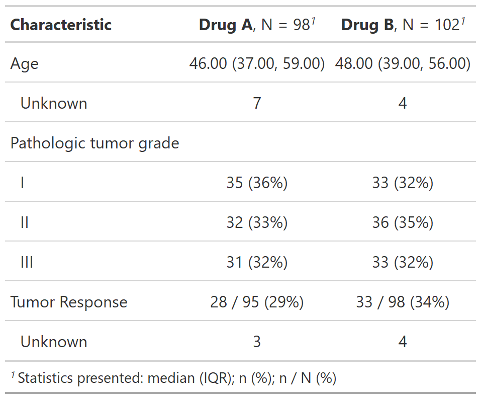
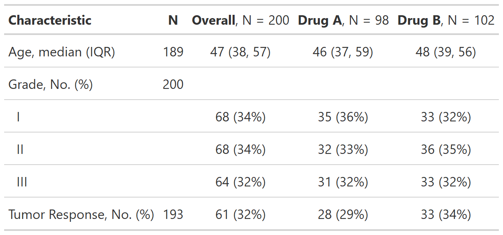

class: inverse, center, middle
# tbl_summary()


---
# Basic tbl_summary()

.pull-left[

```{r results = FALSE}
tbl_summary_1 <- 
  sm_trial %>%
  select(age, grade, response) %>% 
  tbl_summary()
```

```{r include=FALSE}
my_gtsave("tbl_summary_1")
```

.medium[
- Three types of summaries: `continuous`, `categorical`, and `dichotomous`

- Statistics are `median (IQR)` for continuous, `n (%)` for categorical/dichotomous

- Variables coded `0/1`, `TRUE/FALSE`, `Yes/No` treated as dichotomous

- Lists `NA` values under "Unknown"

- Label attributes are printed automatically
]

]

.pull-right[
<p align="center"></p>
]


---
# Customize tbl_summary() output

.pull-left[

```{r results = FALSE}
tbl_summary_2 <- 
  sm_trial %>%
  tbl_summary(
    by = trt,
    statistic = response ~ "{n} / {N} ({p}%)",
    label = grade ~ "Pathologic tumor grade",
    digits = age ~ 2
    )
```

```{r include=FALSE}
my_gtsave("tbl_summary_2")
```

.medium[
- `by`: specifies a column variable for cross-tabulation
- `statistic`: customize the reported statistics
- `label`: change or customize variable labels
- `digits`: specify the number of decimal places for rounding

]
]

.pull-right[
<p align="center"></p>
]


---
# Customize tbl_summary() output

**provide argument**       =    **select variables**      ~   **give instructions**

```{r eval = FALSE}
sm_trial %>%
  tbl_summary(
    statistic    =    all_continuous()        ~    "{mean} ({sd})",
    label        =    starts_with("grade")    ~    "Pathologic grade",
    digits       =    age                     ~    2
    )
```

<br>

Use **lists** to specify more than two choices:

```{r eval = FALSE}
label = list(age ~ "Patient age (years)", grade = "Pathologic tumor grade")
```


---
# Add-on functions in {gtsummary}

.xxlarge[
`tbl_summary()` objects can also be updated using related functions.

- `add_*()` add additional column of statistics or information, e.g. p-values, q-values, overall statistics, N obs., and more

- `modify_*()` modify table headers, spanning headers, and footnotes

- `bold_*()/italicize_*()` style labels, variable levels, significant p-values

]


---
# Update `tbl_summary()` with `add_*()`

.pull-left[
```{r results = FALSE}
tbl_summary_3a <- 
  sm_trial %>%
  tbl_summary(
    by = trt
    ) %>% 
  add_p() %>% 
  add_q()  
```

```{r include = FALSE}
my_gtsave("tbl_summary_3a")
```
]

.pull-right[
<p align="center"></p>
]


---
# Update `tbl_summary()` with `add_*()`

.pull-left[
```{r results = FALSE}
tbl_summary_3b <- 
  sm_trial %>%
  tbl_summary(
    by = trt
    ) %>% 
  add_overall() %>% 
  add_n() %>% 
  add_stat_label(
    label = all_categorical() ~ "No. (%)"
  ) 
```

```{r include = FALSE}
my_gtsave("tbl_summary_3b")
```
]

.pull-right[
<p align="center"></p>
]


---
# Update `tbl_summary()` with `bold_*()/italicize_*()`

.pull-left[
```{r results = FALSE}
tbl_summary_4 <- 
  sm_trial %>%
  tbl_summary(
    by = trt
    ) %>%
  add_p() %>% 
  bold_labels() %>% 
  italicize_levels() %>% 
  bold_p()
```

```{r include = FALSE}
my_gtsave("tbl_summary_4")
```
]

.pull-right[
<p align="center"></p>
]


---
# Update `tbl_summary()` with `modify_*()`

.pull-left[
```{r results = FALSE}
tbl_summary_5 <- 
  sm_trial %>% select(age, response, trt) %>% 
  tbl_summary(
    by = trt
    ) %>%
  modify_header(
    update = list(
      stat_1 ~ "**A**",
      stat_2 ~ "**B**"
    )) %>% 
  modify_spanning_header(
    update = starts_with("stat_") ~ "Drug") %>% 
  modify_footnote(
    update = starts_with("stat_") ~ 
      "median (IQR) for continuous; n (%) for categorical"
  )
```

```{r include = FALSE}
my_gtsave("tbl_summary_5")
```
]

.pull-right[
<p align="center"></p>
]

* Use `show_header_names()` to see the internal header names available for use in `modify_header()`


---
# Add-on functions in {gtsummary}

And many more! 

See the documentation at http://www.danieldsjoberg.com/gtsummary/reference/index.html

And a detailed `tbl_summary()` vignette at http://www.danieldsjoberg.com/gtsummary/articles/tbl_summary.html


